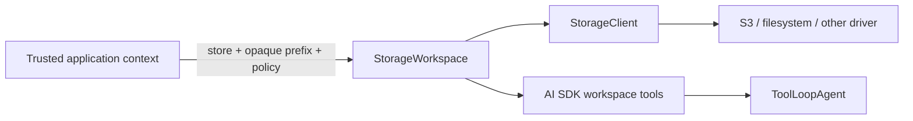

# @nestm/storage

Framework-neutral storage clients with NestJS 12 integration, named stores,
explicit streaming I/O, capability-scoped agent workspaces, cross-store
workflows, and an optional guarded HTTP gateway.

The package uses [`files-sdk`](https://github.com/haydenbleasel/files-sdk) as
its provider engine, but owns the API injected into Nest applications. Provider
SDK types, errors, and `files.raw` do not leak through the root package.

> This package targets stable NestJS 12 and is itself published on the `alpha`
> dist-tag.

## Requirements

- Node.js 22.12 or newer
- ESM

The framework-neutral `@nestm/storage/core` entry point does not require
NestJS. The root entry point and HTTP gateway additionally require NestJS 12,
`reflect-metadata`, and RxJS. Those framework peers are optional at installation
time so core-only consumers do not download NestJS.

## Install

```sh
pnpm add @nestm/storage@alpha
```

The package-owned S3 factory needs no direct `files-sdk` import. Install the
pinned engine explicitly only when the application imports another adapter
such as `files-sdk/gcs`:

```sh
pnpm add files-sdk@2.3.0
```

Pass AWS-SDK-backed S3 adapters through the package-owned `s3()` and
`withS3Capabilities()` helpers (or use `createS3StorageDriver()`).
`createFilesSdkDriver()` rejects a structurally S3-backed raw adapter that has
not crossed this provenance boundary, even when a wrapper renames or proxies
the adapter. This prevents callers from bypassing endpoint and provider-profile
checks by omitting the capability decorator or replacing the public `raw`
property while retaining methods closed over the original client.

Install only the native SDKs required by the chosen provider. For example:

```sh
# S3 and S3-compatible providers
pnpm add @aws-sdk/client-s3 @aws-sdk/s3-presigned-post \
  @aws-sdk/s3-request-presigner @aws-sdk/lib-storage

# Google Cloud Storage
pnpm add @google-cloud/storage google-auth-library

# Azure Blob Storage
pnpm add @azure/storage-blob @azure/core-auth @azure/identity
```

`@aws-sdk/client-s3` 3.1079.0 or newer is required, matching the Files SDK 2.3
peer floor. The supported range includes destination `If-Match` and
`If-None-Match` serialization for `CopyObject`; the package peer range and
packed minimum-peer smoke test enforce this floor.

`files-sdk` currently declares its optional Nest peer for Nest 10 and 11. This
library does not import `files-sdk/nestjs`; the Nest 12 integration is entirely
owned here. A package manager may nevertheless report that temporary optional
peer mismatch until Files SDK widens its declaration to include Nest 12.

## Framework-neutral core

Import storage primitives from `@nestm/storage/core` in workers, scripts, and
applications that do not use NestJS:

```ts
import {
  StorageClient,
  type StorageDriver,
  type StorageUploadOptions,
} from '@nestm/storage/core';

declare const driver: StorageDriver;

const media = new StorageClient('media', driver);

await media.upload('avatars/user.png', image, {
  contentType: 'image/png',
} satisfies StorageUploadOptions);

await media.onApplicationShutdown();
```

The core entry point exports `StorageClient`, the `StorageDriver` contract,
storage errors and operation types, and `StorageUploadControl`. It has no NestJS
runtime or declaration imports. Provider adapters remain available through
`@nestm/storage/files-sdk`.

## Mounted agent workspaces

`@nestm/storage/workspace` turns a `StorageClient` into a narrow capability for
one logical directory. The mount is virtual: the same API works over S3, a
filesystem driver, or another storage backend without exposing the provider,
bucket, filesystem root, raw cursor, or internal prefix to its caller.



Only trusted application code chooses the mount prefix. Every path accepted by
the workspace is a canonical, relative POSIX path. Absolute paths, backslashes,
control characters, repeated separators, and `.` or `..` segments are rejected
rather than normalized. Keys and provider cursors returned by a driver are also
checked before they are converted back to logical paths.

Pagination requires a server-owned cursor configuration. The built-in
`Aes256GcmStorageWorkspaceCursorCodec` produces versioned, authenticated,
encrypted tokens that can resume on another request, process, or replica when
every replica constructs an equivalent codec from the same key ring and uses
the same stable store identity, physical prefix, mount ID, trusted scope, and
effective limits. Use one codec instance per process, use a dedicated 32-byte
key, retain rotated decryption keys for at least one cursor TTL, and derive
`mountId` and `scope` only from authenticated server context.

The underlying driver must also implement the universal replayable list-cursor
contract against the same logical backend namespace: its cursor cannot be
consumed or tied to one driver instance. While the provider cursor remains
valid and available, an outer cursor can be retried until its authenticated
expiry. That expiry is only an authorization ceiling: it does not extend a
provider token's lifetime or promise snapshot isolation, provider availability,
network access, or valid credentials. Provider invalidation is an operational
list failure, and concurrent object changes remain subject to provider
continuation semantics. Without a codec, single-page operations still work but
a continuation fails closed.

```ts
import {
  Aes256GcmStorageWorkspaceCursorCodec,
  mountStorageWorkspace,
} from '@nestm/storage/workspace';

// cursorKey is a separately validated 32-byte secret from deployment config.
const cursorCodec = new Aes256GcmStorageWorkspaceCursorCodec({
  activeKeyId: 'v1',
  keys: { v1: cursorKey },
});

const workspace = mountStorageWorkspace(agentFiles, {
  // Use an opaque server-derived run id, never a value selected by the model.
  prefix: `workspaces/${runId}`,
  cursor: {
    codec: cursorCodec,
    mountId: `agent-workspace:${runId}`,
    scope: `organization:${organizationId}/workspace:${workspaceId}`,
  },
  permissions: [
    'list',
    'read',
    'search',
    'write',
    'create',
    'replace',
    'copy',
    'move',
    'delete',
  ],
  limits: {
    cursorTtlMs: 5 * 60 * 1000,
    maxCursorBytes: 4096,
    maxReadBytes: 1024 * 1024,
    maxWriteBytes: 1024 * 1024,
    maxPageSize: 100,
    maxSearchResults: 100,
    maxSearchScan: 1000,
  },
});

const created = await workspace.writeFile(
  'src/main.ts',
  'export const ready = true;\n',
  { mode: 'create', contentType: 'text/typescript' },
);

if (created.etag === undefined) {
  throw new Error('This backend cannot safely replace the object.');
}

await workspace.writeFile('src/main.ts', 'export const ready = false;\n', {
  mode: 'replace',
  etag: created.etag,
  contentType: 'text/typescript',
});

const image = await workspace.readBytes('assets/logo.png');
console.log(image.bytes.byteLength);
```

`readBytes` is now a required member of the exported `StorageWorkspace`
interface. Workspaces returned by `mountStorageWorkspace` provide it
automatically; custom implementations and typed test doubles must add the
method when adopting this alpha minor.

Create, replace, and delete are conditional operations. A driver that cannot
enforce the requested not-exists or ETag precondition fails with
`NOT_SUPPORTED`; the workspace never substitutes an `exists()`/`head()` check
followed by an unconditional mutation. Reads enforce their byte ceiling while
consuming the stream, and list/search results are bounded. Search supports
exact, substring, and workspace-coordinate glob matching, but no caller-supplied
regular expressions.

Move is implemented as create-only copy followed by ETag-conditional source
delete. If source deletion cannot be confirmed, the destination is retained and
the call returns `CONFLICT`; inspect both logical paths before retrying. This
preserves at least one copy across provider timeouts and post-operation hook
failures, but does not pretend a multi-object move is transactionally atomic.

Callers that prefer the ordinary Files pipeline can opt into explicit
last-write-wins variants. The `write` permission is separate from conditional
`create` and `replace` authority:

```ts
await workspace.writeFile('notes.txt', 'latest contents', {
  mode: 'overwrite',
});
await workspace.copyFile('notes.txt', 'backup.txt', { mode: 'overwrite' });
await workspace.deleteFile('backup.txt', { mode: 'unconditional' });
```

Overwrite copy reads the latest source through the ordinary download pipeline,
enforces `maxWriteBytes` while collecting it, and uploads it through the
ordinary upload pipeline. It never substitutes the provider's server-side
copy. These paths compose with Files SDK plugins, hooks, and receipts, including
the built-in `encryption()` plugin. That plugin is useful compatibility
evidence, not an Artifact-specific security policy: strict encrypted-only
reads, tenant/path-bound AAD, key custody and rotation, and copy/move rules
remain application-owned.

Move remains conditional-only. A last-write-wins download/upload/delete
sequence could copy one source generation and then delete a newer generation
written during the transfer. Use the ETag-conditional `moveFile` variant when a
move is required.

A child mount may further restrict a directory, permissions, or limits, but it
cannot widen any of them:

```ts
const readOnlySource = workspace.mount('src', {
  permissions: ['list', 'read', 'search'],
  limits: { maxReadBytes: 256 * 1024 },
});
```

### AI SDK and NestJS composition

Install AI SDK 7 and Zod only in applications that use the optional adapter:

```sh
pnpm add ai@^7 zod@^4
```

`files-sdk` 2.3.x still declares an optional `ai@^6` peer for its own adapter,
so some package managers may print a peer warning when AI SDK 7 is installed.
This package does not import that adapter; `@nestm/storage/ai-sdk` targets AI
SDK 7 directly.

`@nestm/storage/ai-sdk` converts an already-mounted workspace to an ordinary
upstream `ToolSet`. It does not import NestJS or `@nestm/ai-sdk`; the application
composes the tool set through the AI module's existing named-toolset factory.
For a tenant or run selected per request, make both factories request-scoped and
derive the mount coordinate from authenticated host context:

```ts
import { Module, Scope } from '@nestjs/common';
import { AiSdkModule, AiSdkService, getAiToolsetToken } from '@nestm/ai-sdk';
import { getStorageToken, type StorageClient } from '@nestm/storage';
import { createAiSdkWorkspaceTools } from '@nestm/storage/ai-sdk';
import { mountStorageWorkspace } from '@nestm/storage/workspace';
import type { ToolSet } from 'ai';

@Module({
  imports: [
    AppStorageModule,
    WorkspaceContextModule,
    AiSdkModule.forFeature({
      imports: [AppStorageModule, WorkspaceContextModule],
      toolsets: [
        {
          name: 'workspace',
          scope: Scope.REQUEST,
          inject: [getStorageToken('agent-files'), WorkspaceContext],
          useFactory: (storage: StorageClient, context: WorkspaceContext) =>
            createAiSdkWorkspaceTools({
              workspace: mountStorageWorkspace(storage, {
                // A validated, opaque coordinate from trusted auth/run state.
                // It is never accepted from a prompt or tool input.
                prefix: context.storagePrefix,
                // Includes the singleton codec plus stable mountId and scope.
                cursor: context.cursorConfiguration,
                permissions: [
                  'list',
                  'read',
                  'search',
                  'write',
                  'create',
                  'replace',
                  'copy',
                  'move',
                  'delete',
                ],
              }),
            }),
        },
      ],
      agents: [
        {
          name: 'workspace-agent',
          scope: Scope.REQUEST,
          inject: [AiSdkService, getAiToolsetToken('workspace')],
          useFactory: (ai: AiSdkService, tools: ToolSet) => ({
            model: ai.languageModel(),
            instructions:
              'Use only the mounted workspace tools for file operations.',
            tools,
          }),
        },
      ],
    }),
  ],
})
export class WorkspaceAgentModule {}
```

The generated set contains only tools allowed by the workspace permissions:
bounded list, stat, UTF-8 read, and search tools plus conditional create,
replace, copy, move, and delete tools when granted. Mutation tools require AI
SDK user approval by default; approval can be configured per tool, but the
workspace capability remains the authorization boundary even when approval is
disabled. The module's `AiSdkService.files()` API is the model provider's file
upload facility and is unrelated to storage workspaces.

`mutationMode` defaults to `'conditional'`. A trusted composition can instead
select `{ mutationMode: 'last-write-wins' }`; generated mutation schemas then
omit ETags and modes, hardcode the explicit overwrite/unconditional workspace
variants, and require `write` permission for destination mutations.
Unconditional delete requires both `write` and `delete`. The move tool is
omitted in last-write-wins mode because Workspace move remains conditional-only.

Atomic create collisions remain sanitized tool errors by default. Applications
that model an existing destination as a normal tool result can map that one
case while preserving replace/ETag conflicts as failures:

```ts
const tools = createAiSdkWorkspaceTools({
  workspace,
  mapCreateConflict: ({ path }) => ({
    kind: 'artifact-conflict' as const,
    path,
    status: 'already-exists' as const,
  }),
});
```

The mapper receives only the logical workspace path; provider errors, object
keys, and mount coordinates are never exposed. `mapCreateConflict` is valid
only in conditional mode and is rejected with last-write-wins mode.

This logical confinement is sufficient for a `ToolLoopAgent` whose only file
capabilities are these tools. It cannot constrain a coding harness that already
has shell, `node:fs`, or subprocess access. For Codex/Claude-style harnesses,
materialize the workspace into a per-session container or VM, mount only that
directory, run the harness there, and synchronize reviewed changes back through
`StorageWorkspace`. A working directory alone is not a sandbox.

## Configure named stores

Use the package-owned S3 factory when applicable. For other providers, create a
`files-sdk` adapter, wrap it through the explicit bridge, and register the
resulting driver:

```ts
import { Module } from '@nestjs/common';
import { gcs } from 'files-sdk/gcs';
import { createFilesSdkDriver } from '@nestm/storage/files-sdk';
import { createS3StorageDriver } from '@nestm/storage/files-sdk/s3';
import { StorageModule } from '@nestm/storage';

export const StorageKey = {
  MEDIA: 'media',
  ARCHIVE: 'archive',
} as const;

@Module({
  imports: [
    StorageModule.forRoot({
      default: StorageKey.MEDIA,
      stores: [
        {
          name: StorageKey.MEDIA,
          driver: createS3StorageDriver({
            adapter: {
              bucket: 'media',
              region: 'us-east-1',
            },
          }),
        },
        {
          name: StorageKey.ARCHIVE,
          driver: createFilesSdkDriver({
            adapter: gcs({
              bucket: 'archive',
            }),
          }),
        },
      ],
    }),
  ],
  exports: [StorageModule],
})
export class AppStorageModule {}
```

`StorageModule` is not global by default. Import the configured module wherever
its exports are needed, re-export it from an infrastructure module as above, or
set `isGlobal: true` deliberately.

Inject one store directly:

```ts
import { Injectable } from '@nestjs/common';
import { InjectStorage, type StorageClient } from '@nestm/storage';

@Injectable()
export class AvatarService {
  constructor(
    @InjectStorage(StorageKey.MEDIA)
    private readonly media: StorageClient,
  ) {}

  upload(userId: string, body: ReadableStream<Uint8Array>) {
    return this.media.upload(`avatars/${userId}.png`, body, {
      contentType: 'image/png',
      multipart: true,
    });
  }
}
```

Or select stores through the manager:

```ts
import { Injectable } from '@nestjs/common';
import { StorageService } from '@nestm/storage';

@Injectable()
export class ArchiveService {
  constructor(private readonly storage: StorageService) {}

  async archive(key: string) {
    const object = await this.storage.use(StorageKey.MEDIA).downloadStream(key);
    return this.storage
      .use(StorageKey.ARCHIVE)
      .upload(`retained/${key}`, object.body, {
        contentType: object.contentType,
        ...(object.metadata !== undefined && {
          metadata: object.metadata,
        }),
      });
  }
}
```

`storage.use()` selects the configured default. When several stores are
registered without `default`, callers must pass a name.

### Async registration

Store names remain static because Nest must create their injection tokens
before an async factory runs:

```ts
StorageModule.forRootAsync({
  default: 'media',
  imports: [ConfigModule],
  stores: [
    {
      name: 'media',
      inject: [ConfigService],
      useFactory: (config: ConfigService) =>
        createS3StorageDriver({
          adapter: {
            bucket: config.getOrThrow('MEDIA_BUCKET'),
            region: config.getOrThrow('AWS_REGION'),
          },
        }),
    },
  ],
});
```

`useClass` and `useExisting` are also supported through
`StorageDriverFactory#createStorageDriver(name)`. Feature-owned stores use the
same shapes through `forFeature()` and `forFeatureAsync()` and export only
their named `@InjectStorage(name)` clients; the root `StorageService` remains
isolated to the stores declared by `forRoot`.

Duplicate names within one registration fail immediately. Separate feature
modules retain their own DI scope rather than mutating an application-wide
registry. Names are case-sensitive and cannot contain leading or trailing
whitespace.

### Select the provider at runtime

An application that ships to more than one environment usually cannot name its
provider at build time. `createProviderStorageDriver` takes the slug as data and
imports that provider's adapter — and only that one — on demand, so a deployment
picks its store with an environment variable and installs one native SDK:

```ts
import { createProviderStorageDriver } from '@nestm/storage/files-sdk/provider';

StorageModule.forRootAsync({
  imports: [ConfigModule],
  stores: [
    {
      name: 'media',
      inject: [ConfigService],
      useFactory: (config: ConfigService) =>
        createProviderStorageDriver({
          provider: config.getOrThrow('STORAGE_PROVIDER'),
          prefix: config.get('STORAGE_PREFIX'),
          config: {
            bucket: config.get('STORAGE_BUCKET'),
            region: config.get('STORAGE_REGION'),
            root: config.get('STORAGE_ROOT'),
          },
        }),
    },
  ],
});
```

`config` is one flat bag of provider settings — `bucket` and `region` for an
object store, `root` for the filesystem, `accountName` and `container` for
Azure. Each provider reads what it needs and ignores the rest, so the same shape
survives a provider change. Credentials may be omitted wherever the provider's
SDK resolves its own chain (an IAM role, Application Default Credentials, a
shared profile).

An unknown slug fails closed with `INVALID_ARGUMENT` before anything is
imported. Validate untrusted input up front with `isStorageProvider`, and drive
config validation from the catalog rather than a hand-kept list:

```ts
import {
  getStorageProvider,
  isStorageProvider,
  listStorageProviders,
  listStorageProviderSecretEnvVars,
} from '@nestm/storage/files-sdk/provider';

listStorageProviders().map((provider) => provider.slug); // 'akamai', 'alibaba', …
getStorageProvider('gcs')?.peerDeps; // ['@google-cloud/storage', …]
listStorageProviderSecretEnvVars('s3').map((variable) => variable.key);
```

The catalog is pure data and pulls in no adapter, so it is safe in config UIs,
health checks, and startup validation.

The `s3` slug additionally carries the verified per-operation profile and
signed-policy capabilities described under
[Exact provider conditions and staged-object promotion](#exact-provider-conditions-and-staged-object-promotion);
every provider not backed by the AWS S3 SDK exposes what its adapter declares.
When the provider _is_ known at build time, import
`@nestm/storage/files-sdk/s3` or `@nestm/storage/files-sdk/fs` directly and skip
the indirection.

S3 endpoint and public-URL provenance is resolved from the adapter that
`files-sdk` actually constructs, including values merged from `configJson`.
An unaudited endpoint forces the driver read-only, and a `publicBaseUrl` removes
the signed-download TTL guarantee because the resulting public URL does not
expire. AWS-SDK-backed noncanonical provider slugs (for example an S3-compatible
provider wrapper) also default to unverified/read-only; only the canonical
`s3` provider may infer the native AWS profile, and a custom endpoint becomes
writable only with an explicit branded `S3ProviderProfile`.

Before enabling conditional operations for a custom S3-compatible endpoint,
run the reusable
[provider conformance contract](https://github.com/nestm-dev/storage/blob/main/docs/provider-conformance.md)
against dedicated test credentials. Unknown endpoints are forced read-only and
receive no inferred conditional capabilities.

## Files SDK responsibility boundary

Files SDK is the upstream authority for the generic storage data plane:
provider adapters, generic CRUD, bulk and list operations, retries, transfers
and sync, its plugin pipeline, and framework-neutral gateway mechanics.
`@nestm/storage` retains the guarantees that Files SDK does not currently
provide: NestJS 12 named stores, exact native conditional/CAS capabilities,
`StorageWorkspace` permissions and limits, bounded storage errors, and
capability-scoped AI tools.

Files SDK 2.3 provides native conditional operations through the same
interception boundary as ordinary CRUD. NestM adapters expose their exact
create, replace, ETag read, delete, and paired conditional-copy primitives to
that boundary. These operations now pass through caller-configured Files
plugins, hooks, retries, and receipts; a body transform, veto, retry observer,
or audit policy therefore sees the conditional operation instead of being
bypassed.

NestM retains a narrow direct fallback only for conditional shapes Files SDK
2.3 cannot represent: immutable version predicates, conditional
multipart/resumable completion, and a copy with only its source or only its
destination conditioned. Because those fallbacks cannot traverse the Files
operation pipeline, they remain fail-closed when caller Files policy is active:

| Operation shape                                             | Execution path        | With Files plugins, active hooks, or receipts |
| ----------------------------------------------------------- | --------------------- | --------------------------------------------- |
| Ordinary operations                                         | Files pipeline        | Available                                     |
| Create/replace/ETag read/delete/paired conditional copy     | Files 2.3 pipeline    | Available                                     |
| Version, conditional multipart/resumable, or one-sided copy | NestM direct fallback | Hidden; invocation returns `NOT_SUPPORTED`    |

An empty plugin list, an empty hooks object, and `receipts: false` do not count
as caller policy. When available, a direct fallback still applies prefixing,
the physical-key budget, read-only restrictions, default retry/signal/timeout
options, and bounded error mapping. `StoragePlugin` remains a separate
veto/observation boundary; it is not a substitute for Files body or result
transforms.

`StorageWorkspace` uses the Files pipeline whenever its conditional operation
has an upstream representation. Lower-level conditional client and driver APIs
remain available for applications that intentionally use the policy-free
NestM-only fallback shapes.

## Storage API

`StorageClient` exposes:

- `upload`, `downloadStream`, `head`, `exists`, `delete`, `copy`, and `move`;
- exact `uploadConditional`, `downloadConditional`, `deleteConditional`, and
  staged-object `promote` operations when the driver advertises each primitive;
- `list`, cursor-aware `listAll`, and lazy `search`;
- `signDownload` and discriminated PUT/POST `signUpload`;
- `uploadMany`, `downloadMany`, `headMany`, `existsMany`, and `deleteMany`;
- `file(key)` handles;
- provider capability inspection; and
- pause/resume/abort through `StorageUploadControl`.

Provider list cursors are opaque, non-consuming continuation tokens. Replaying
the same cursor and page limit against unchanged provider-visible state must
return an equivalent page and continuation position, even after a descendant
cursor has been used. A cursor is bound to the logical store, `prefix`, and
`delimiter`, but not to `limit`, retries, timeout, or abort signal; callers may
change those transport/page-size options while resuming the same position.

The cursor must work through a newly constructed compatible driver targeting
the same backend namespace while the provider token remains valid and
available; it cannot depend on process-, client-, or session-local state. An
adapter for a consuming or instance-bound provider token must materialize a
stable continuation before it can provide conforming paginated
`StorageDriver.list` results. This contract lets a caller safely retry, replay,
or resume pagination on another replica. It does not promise a provider-token
lifetime, snapshot isolation across concurrent mutations, or provider,
network, credential, or authorization availability. Provider invalidation is
an ordinary list-operation failure.

Downloads are streaming by default:

```ts
const object = await storage.use('media').downloadStream('video.mp4');
// object.body is a Web ReadableStream<Uint8Array>
```

The explicit `downloadBytes`, `downloadText`, and `downloadJson` helpers default
to a 10 MiB in-memory limit:

```ts
const manifest = await storage
  .use('media')
  .downloadJson<{ version: number }>('manifest.json', {
    maxBytes: 256 * 1024,
  });
```

Node `Readable` uploads are accepted and converted to Web streams without
buffering. Provider capability gaps fail closed with `StorageError` rather than
silently discarding a range, metadata, or cache-control request.

### Exact provider conditions and staged-object promotion

Capabilities distinguish conditional create, replace, delete, read, source
copy, destination copy, atomic source-and-destination promotion, and multipart
completion. They also declare the complete physical-key byte budget. Callers
must check the exact primitive they need; a missing field is unsupported and is
never widened from another operation.

Some adapters expose conditional copy only as a paired source-and-destination
operation. In that case,
`capabilities.conditionalCopySource.requiresDestinationPredicate` and
`capabilities.conditionalCopyDestination.requiresSourcePredicate` are `true`.
`StorageClient.promote` rejects a request missing the required counterpart
before provider I/O. A paired request must also satisfy the advertised
create/replace bit and
`capabilities.conditionalCopyDestination.atomicWithSource`.

The physical-key budget applies to the exact key sent to the adapter. It
therefore counts leading slashes for unprefixed drivers, the separator added to
a configured driver prefix, and provider prefixes derived for `list` or
`search`. Over-budget object keys and explicit list/search prefixes fail before
provider dispatch rather than being normalized into a shorter key. A glob's
provider prefix is the exact prefix inferred by files-sdk itself, and that
derived list operation passes through the same final guard. A non-positive
`maxResults` performs no provider walk and therefore dispatches no prefix.

Adapters and plugins execute as trusted in-process code; this package does not
attempt to sandbox a plugin that performs its own network or filesystem I/O.
For supported plugin pipelines that forward operations through `next`, the
physical-key guard is the innermost wrapper, after caller plugins and before
the adapter call. A plugin therefore cannot widen an upload key or list/search
prefix past the declared byte ceiling while still using the normal dispatch
pipeline.

Storage-facing ETags have one canonical representation: a bare, case-sensitive
opaque token with no HTTP quotes. Canonical values contain 1–1024 visible
ASCII bytes and exclude commas, backslashes, whitespace, control characters,
`DEL`, non-ASCII text, the `*` wildcard, and case-insensitive `W/` weak-tag
prefixes. Treat the value as opaque: preserve the exact string returned by
`head`, reads, or writes and pass it back unchanged to a conditional operation.
Do not add or remove quotes in application code. S3-compatible drivers remove
exactly one valid provider-owned quote pair on ingress and add exactly one pair
when serializing the HTTP header.

This tightens the precondition boundary. Quoted or otherwise non-canonical
ETags that older versions happened to accept now fail with `INVALID_ARGUMENT`,
and an unsafe provider result fails with a sanitized `PROVIDER` error instead
of being exposed as a usable validator. Applications that persisted quoted
ETags must refresh them with `head` rather than trimming them heuristically.
Strict normalization prevents a caller-controlled wildcard, entity-tag list,
weak validator, or malformed header value from widening an operation that
promises one exact strong match.

The native AWS S3 profile advertises ETag- and version-conditioned server-side
copy. This lets an application validate a staged object and copy that exact
source to its final key instead of re-reading whichever bytes occupy the
staging key later:

```ts
import { StorageError, StorageErrorCode } from '@nestm/storage';

const staged = await media.head(stagingKey);
if (staged.etag === undefined) {
  throw new StorageError('Provider did not return a source ETag.', {
    code: StorageErrorCode.NOT_SUPPORTED,
  });
}

// Validate size, declared MIME, and magic bytes before this call.
await media.file(stagingKey).promoteTo(finalKey, {
  sourceEtag: staged.etag,
});

// Commit ready metadata first. Promotion deliberately retains the staged
// object so a failed database commit remains recoverable.
await media.delete(stagingKey);
```

`sourceVersion` can select an immutable S3 version and may be combined with
`sourceEtag`. A destination condition can independently require create-only or
replacement of an exact ETag. Combining source and destination predicates also
requires `capabilities.conditionalCopyDestination.atomicWithSource`; otherwise
the request fails with `NOT_SUPPORTED`. A promotion must contain at least one
source or destination predicate.

Cloudflare R2 has a separate stable profile: create, replace, ETag-conditioned
read, and ETag-conditioned source copy are enabled, while conditional delete,
destination copy, atomic promotion, version predicates, and conditional
multipart completion remain absent. R2 proves content-type binding for
presigned PUT requests but not POST-form size ranges, so its signed-upload
policy is `{ contentType: true, sizeRange: false }` and the gateway refuses to
mint its POST upload form. Cloudflare documents that presigned `POST` form
uploads are not supported in its
[presigned URL contract](https://developers.cloudflare.com/r2/api/s3/presigned-urls/).
Direct R2 signed-upload calls that request a size bound likewise fail with
`NOT_SUPPORTED` before signing.
Custom S3-compatible endpoints start with no conditional operations and the
entire driver is forced read-only until an explicit conformance-verified
`S3ProviderProfile` is supplied. Omitting `signedUploadPolicy` while defining a
custom profile normalizes both policy claims to `false`; providers may opt in
only to constraints their conformance evidence proves.

Successful S3 signed uploads enforce every requested constraint. A request
with `contentType` and no `maxSize` uses a presigned PUT whose signature
includes the `content-type` header. A request with `maxSize` uses a POST policy
with `content-length-range` and, when present, an exact `Content-Type`
condition. S3 cannot express a lower-only `minSize` through this contract, so
that shape fails with `NOT_SUPPORTED`; an unclaimed profile constraint also
fails before credentials are resolved or a URL is minted. Literal physical
keys ending in AWS's `${filename}` POST template are rejected for bounded
uploads because the SDK otherwise widens the exact key condition to a prefix.

`withS3Capabilities()` decorates a raw S3 adapter in place and may be applied
only once. Construct a fresh raw adapter when selecting a different profile;
reapplying the helper is rejected so a previous broader profile cannot survive
a later narrower declaration. The selected profile is bound to the exact
reserved capability and operation members installed by that decoration;
same-client aliases may change display metadata but cannot add or replace those
members to widen the profile.

An explicit profile applied to a native AWS SDK endpoint may only narrow the
immutable `AWS_S3_PROVIDER_PROFILE`. It cannot raise the complete-key budget
above 1,024 bytes or claim an operation/policy bit absent from the built-in
profile. This containment follows actual SDK endpoint provenance even when an
adapter alias changes its display name.

The package-owned `s3()` factory also retains whether `publicBaseUrl` was
configured even when the second `withS3Capabilities()` options object is
omitted. In that case `signedDownloadPolicy.expiresIn` is false. Foreign S3
adapters whose construction metadata is unavailable receive the same
conservative false value instead of claiming an enforceable TTL.

### Resumable uploads

```ts
import { StorageUploadControl } from '@nestm/storage';

const control = new StorageUploadControl();
const upload = media.upload('large.bin', file, {
  control,
  multipart: { partSize: 8 * 1024 * 1024, concurrency: 4 },
});

control.pause();
const token = control.toJSON(); // opaque and JSON-serializable
control.resume();
await upload;
```

Persisted tokens are intentionally opaque and versioned. Restore one with
`StorageUploadControl.from(token)`. Resumable uploads require a repeatable,
known-length body; a one-shot stream cannot be resumed.

### Cross-store transfer and sync

```ts
await storage.transfer({
  from: 'media',
  to: 'archive',
  prefix: 'uploads/',
  concurrency: 4,
});

const preview = await storage.sync({
  from: 'media',
  to: 'archive',
  compare: 'size',
  prune: true,
  dryRun: true,
});
```

Object bodies stream directly between stores. Key lists and metadata are
collected to provide deterministic progress and sync plans. Partial failures
are returned in `errors`. `prune: true` is destructive; use `dryRun` first and
scope the destination with `destinationPrefix`.

## Optional HTTP gateway

The gateway lives at `@nestm/storage/gateway` and is never mounted by
`StorageModule`.

```ts
import { Injectable, Module } from '@nestjs/common';
import {
  StorageGatewayModule,
  StorageGatewayOperation,
  type StorageGatewayKeyPolicy,
} from '@nestm/storage/gateway';

@Injectable()
class TenantStorageKeyPolicy implements StorageGatewayKeyPolicy {
  resolve({ input, request, target }) {
    const tenantId = tenantIdFromAuthenticatedRequest(request);
    const root = `tenants/${base64url(tenantId)}`;
    if (target === 'pattern') {
      // Search is already constrained by the separately resolved prefix.
      return input?.value ?? '*';
    }
    return `${root}/${input?.value ?? ''}`;
  }
}

@Module({
  providers: [TenantStorageKeyPolicy],
  exports: [TenantStorageKeyPolicy],
})
class StoragePolicyModule {}

@Module({
  imports: [
    AppStorageModule,
    AuthModule,
    StoragePolicyModule,
    StorageGatewayModule.register({
      imports: [AppStorageModule, AuthModule, StoragePolicyModule],
      store: 'media',
      guards: [JwtAuthGuard],
      keyPolicy: TenantStorageKeyPolicy,
      mode: 'hybrid',
      operations: [
        StorageGatewayOperation.DOWNLOAD,
        StorageGatewayOperation.UPLOAD,
        StorageGatewayOperation.HEAD,
        StorageGatewayOperation.LIST,
        StorageGatewayOperation.SIGN_DOWNLOAD,
        StorageGatewayOperation.SIGN_UPLOAD,
      ],
      maxUploadBytes: 100 * 1024 * 1024,
      maxSignedUploadBytes: 10 * 1024 * 1024,
      signedUploadContentTypes: ['image/jpeg', 'image/png'],
      maxSignedUrlExpiresIn: 900,
      maxListResults: 1000,
      maxSearchResults: 1000,
      proxyInlineContentTypes: ['image/jpeg', 'image/png'],
    }),
  ],
})
export class AppModule {}
```

Registration fails without at least one existing Nest guard. The only bypass is
the explicit `allowUnauthenticated: true` development escape hatch. Operations
are deny-by-default and must be allowlisted individually.

Registration also fails without a `keyPolicy`. Guards answer whether a request
may reach the gateway; the key policy independently resolves every parsed
`key`, `prefix`, search `pattern`, `from`, and `to` value to the exact provider
path. It runs even when a list/search prefix was omitted, so the policy can
always impose a tenant root. Key-policy providers may be request scoped.
Returned paths are parsed again and reject absolute paths, backslashes, control
characters, empty segments, and dot/parent segments.

Existing single-tenant applications can temporarily set
`unsafeAllowUnscopedKeys: true` instead of `keyPolicy`. The name is intentional:
it preserves caller-controlled provider keys and must not be used on an exposed
or multi-tenant gateway. It cannot be combined with `keyPolicy`.

Proxy downloads default to `Content-Disposition: attachment` and always send
`X-Content-Type-Options: nosniff`. Add only trusted, non-active MIME types to
`proxyInlineContentTypes` when browser rendering is required. Search responses
are capped by `maxSearchResults`, and list pages by `maxListResults` (both
1,000 by default).

Every signed URL is capped by `maxSignedUrlExpiresIn` (3,600 seconds by
default). Signed uploads always carry a provider-enforced maximum size, capped
by `maxSignedUploadBytes`, and require an exact lowercase MIME type from
`signedUploadContentTypes`. The default direct-upload allowlist contains only
`application/octet-stream`. Gateway callers may request only the literal
`attachment` or `inline` response disposition; arbitrary response-header text
and filenames are rejected. A driver must also advertise
`signedUploadPolicy.contentType` and `signedUploadPolicy.sizeRange`; otherwise
the gateway refuses to mint the URL. Native AWS advertises both and uses S3
POST policy conditions. R2 advertises content-type enforcement but not a POST
size range, while omitted custom declarations normalize both claims to false;
the gateway therefore fails closed for those profiles. Signed downloads
similarly require
`signedDownloadPolicy.expiresIn`. The S3 factory advertises it only when no
permanent `publicBaseUrl` was configured, preventing a configured TTL from
silently returning a non-expiring public link.

The fixed gateway prefix is `/storage`:

| Method   | Path                        | Operation                            |
| -------- | --------------------------- | ------------------------------------ |
| `GET`    | `/storage/object?key=...`   | signed redirect or streamed download |
| `PUT`    | `/storage/object?key=...`   | streamed proxy upload                |
| `HEAD`   | `/storage/metadata?key=...` | object metadata                      |
| `DELETE` | `/storage/object?key=...`   | delete                               |
| `GET`    | `/storage/list`             | list one page                        |
| `GET`    | `/storage/search`           | search keys                          |
| `POST`   | `/storage/sign-download`    | sign download                        |
| `POST`   | `/storage/sign-upload`      | sign direct upload                   |
| `POST`   | `/storage/copy`             | copy                                 |
| `POST`   | `/storage/move`             | move                                 |

Proxy uploads use `Content-Type: application/octet-stream`; put the stored MIME
type in `X-Storage-Content-Type`. This keeps Express and Fastify uploads as raw
streams and avoids global body-parser changes. Generic multipart/form-data is
not mounted by the gateway—prefer direct signed uploads or handle form parsing
in an application controller.

If an application has already registered an
`application/octet-stream` parser, the gateway leaves it in place; that parser
must enforce its own body limit and expose either a byte buffer or readable
stream. Without an existing parser, the built-in Fastify parser is restricted
to the marked gateway upload route.

`hybrid` mode prefers a signed download when both `download` and
`signDownload` are allowed and the provider advertises support, then uses the
streaming proxy when signing is unavailable. `proxy` disables signing routes;
`signed` disables proxy uploads and downloads.

## Errors and capabilities

Every thrown engine/provider failure is normalized to `StorageError`. Branch on
`error.code`, not provider classes:

```ts
import { isStorageError, StorageErrorCode } from '@nestm/storage';

try {
  await media.head(key);
} catch (error) {
  if (isStorageError(error) && error.code === StorageErrorCode.NOT_FOUND) {
    return null;
  }
  throw error;
}
```

`files-sdk` `NotFound` failures retain `StorageErrorCode.NOT_FOUND`, including
when a provider adapter and this driver resolve separate copies of `files-sdk`.
`isStorageError()` likewise recognizes branded and exact legacy structural
errors produced by a duplicated `@nestm/storage` package copy.

For a conditional mutation, `error.applied === true` means the provider commit
succeeded but acknowledgement failed afterward, for example in an awaited
post-operation plugin. Conditional uploads also expose `error.appliedEtag` when
the committed generation is known. Do not blindly retry the original
predicate: reconcile the logical destination first, using an exact ETag read
when `appliedEtag` is present. This is a one-way signal: `applied === false`
does not prove that a remote mutation did not commit. A timeout, connection
loss, or exhausted retry can lose the provider's success response, so reconcile
ambiguous transport/provider failures before repeating a conditional mutation.
The sanitized workspace, AI-tool, and gateway error boundaries retain only
this bounded reconciliation metadata.

Capability flags cover range reads, native byte-level upload progress,
delimiter listing, metadata, cache control, resumable uploads, server-side
copy, conditional promotion, and signed transfers.
Provider-specific native clients are intentionally not exposed from the root
package.

## Local and in-memory stores

The test helper wraps the `files-sdk` in-memory adapter:

```ts
import { createMemoryStorageDriver } from '@nestm/storage/testing';

StorageModule.forRoot({
  stores: [{ name: 'test', driver: createMemoryStorageDriver() }],
});
```

For local filesystem storage, use the package-owned factory. The adapter reaches
only `node:fs`, so it needs no native SDK:

```ts
import { createFsStorageDriver } from '@nestm/storage/files-sdk/fs';

StorageModule.forRoot({
  stores: [
    {
      name: 'artifacts',
      driver: createFsStorageDriver({ adapter: { root: './var/artifacts' } }),
    },
  ],
});
```

Bodies are written verbatim at `<root>/<key>`. A `<key>.meta.json` sidecar beside
each one carries the content type, ETag, and custom metadata a filesystem has
nowhere else to put; sidecars never surface as keys, and uploading a key ending
in `.meta.json` fails closed rather than colliding with one. Ordinary and
conditional mutations made through the decorated adapter share one
process-local lock domain. Conditional guarantees therefore require a
dedicated root: do not mutate it through another process, an unwrapped adapter,
or direct filesystem calls.

## License

MIT
